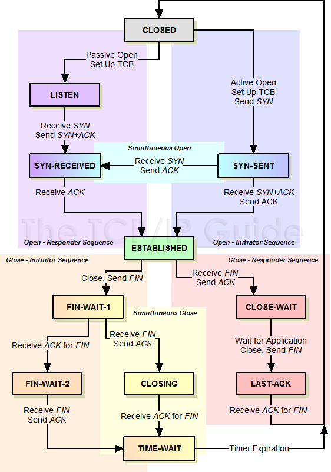
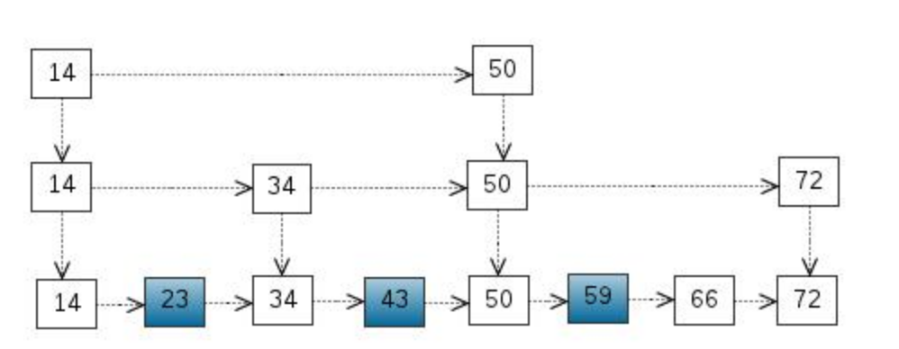

## 1. 堆空间与栈空间

- **栈**是为执行**线程**留出的内存空间，附属于线程。函数调用时，stack pointer压入，栈顶依次（由高到低）储存函数参数、返回值与局部变量。函数返回时，stack pointer推出。

- **堆**是为动态分配预留的内存空间，通常每一个进程只有一个堆。堆包含一个**链表**来维护内存块，所以堆可以不是连续的，但堆内存的申请是连续的。堆内存地址从低位向高位增长。
- 栈比堆快。因为它可以通过简单的指针自增/减来分配/释放。

## 2. 进程，线程与锁

- **进程**，即正在进行的程序，是系统资源分配和调度的一个独立单位。它拥有独立的系统资源与内存地址空间。
- **线程**是进程的实体，是CPU调度和能独立运行的基本单位。一个进程可以拥有多个线程同时执行（实现并行），线程间共享进程资源（堆）与数据。线程拥有自己的栈空间。
- **多任务**的实现：1. 并发，核数小于线程数，**时间片轮转进程调度算法**，每个进程轮流使用CPU极短时间。2. 并行，核数大于线程数。
- **线程同步**
  - 互斥锁
    - 读写锁：改进版的互斥锁，允许大规模并行读操作。
      - 实现：基于互斥锁，使用两个整数记录当前读者数与写者数
      - 读优先：可以实现最大效率的并行读，但可能starve写请求的线程
      - 写优先：并行度稍低
  - 信号量 semaphore（互斥锁是特殊的信号量，仅允许一个线程获取）：允许一定数量的线程访问同一资源
  - 事件（信号）：使用通知来保持同步
- **进程通信**
  - 管道：数据只能在进程间单向流动（半双工），只能用于亲缘进程通信（父子，兄弟）。数据传输后，管道清除数据。
  - 命名管道 FIFO：可在无关进程间传递数据，半双工。
  - 信号量：控制多个进程对资源的访问，通常作为锁
  - 消息队列
  - 共享内存

## 3. TCP连接的建立与断开

- TCP是OSI（Open System Interconnection）模型中的**传输层**协议。模型中的五层分别为物理层、数据链路层、网络层、传输层和应用层。

- **建立连接**
  - 三次握手 Three-way Handshake
  - 连接服务器指定端口，建立 TCP 连接，并同步连接双方的序列号和确认号，交换 TCP 窗口大小信息。
  - 过程
    - **第一次握手（SYN=1, seq=x）**：客户端发送一个SYN=1的包，指明客户端打算连接的服务器的端口，以及初始序号（ISN）x，保存在包头的序列号（Sequence Number）字段里。
    - **第二次握手（SYN=1, ACK=1, seq=y, ACKnum=x+1）**：服务器发回确认包ACK应答，其中SYN和ACK标志位均为1。服务器端选择自己的初始序列号y并放到 Seq字段里，同时将确认序号(Acknowledgement Number)设置为客户的ISN加1，即x+1。 发送完毕后，服务器端进入 `SYN_RCVD` 状态。
    - **第三次握手（ACK=1, seq=x+1, ACKnum=y+1）**：客户端再次发送确认包，SYN 标志位为0，ACK 标志位为1。并且把服务器发来 ACK 的序列字段seq+1，放在确定序号ACKnum中。发送完毕后，客户端进入 `ESTABLISHED` 状态，当服务器端接收到这个包时，也进入 `ESTABLISHED` 状态，TCP 握手结束。
- **断开连接**
  - 四次挥手 Four-way Handshake
  - 客户端与服务端皆可主动发起。
  - 过程（假设客户端主动断开连接）：
    - **第一次挥手（FIN=1, seq=x）**：客户端发送一个标志FIN=1的包，并进入 `FIN_WAIT_1` 状态。
    - **第二次挥手（ACK=1, ACKnum=x+1）**：服务端发送一个确认包ACK，表示已接收关闭连接的请求，但还没有准备好关闭。服务器端进入 `CLOSE_WAIT` 状态。客户端接到确认包后，进入 `FIN_WAIT_2` 状态。
    - **第三次挥手（FIN=1, seq=y）**：服务器端已准备好关闭连接时，向客户端发送关闭请求FIN=1。服务器进入 `LAST_ACK` 状态。
    - **第四次挥手（ACK=1, ACKnum=y+1）**：客户端接收到关闭请求，发送一个确认包并进入 `TIME_WAIT` 状态，等待可能出现的重传的ACK包。服务端接受确认包后，关闭连接并进入 `CLOSED` 状态。客户端等待固定时间时间后，认为服务端已正常关闭连接，也进入 `CLOSED` 状态。
- **TCP Finite State Machine**



- ACK的序列号是累积的，ACKnum=N表示所有N之前的ACK包已经成功接受。
  - 一个完整的TCP连接是双向和对称的，数据可以在两个方向上平等地流动。给上层应用程序提供一种`双工服务`。一旦建立了一个连接，这个连接的一个方向上的每个TCP报文段都包含了相反方向上的报文段的一个ACK。
- 为什么建立连接只要**三次**握手，而断开连接需要**四次**挥手？
  - 断开连接时，服务端需保证数据传输已经完成。建立连接不需要确保，所以相当于把过程2和3合并成了一次。
- TCP不是100%可靠的协议，它所能提供的是**数据的可靠递送**与**故障的可靠通知**。
  - 保证数据**按序**发送与到达。
  - 利用固定间隔**重传**，确保可靠传输。
- TCP流量控制：滑动窗口
- TCP拥塞控制
- 长链接（Connection: keep-alive）与短连接
  - 长连接指在一个持久的TCP连接上，可以连续发送多个数据包。在没有数据通信时，双方发送心跳包HeartBeat来保持连接。HTTP1.1默认采取TCP长连接模式。
  - 短连接在数据传输完成后即断开。
- TCP和UDP的区别
  - TCP协议要求客户端与服务端建立连接，而UDP无连接
  - TCP保证可靠性，而UDP不能保证数据到达
  - TCP为一对一，UDP可以是多对一或多对多
  - e.g. QQ使用UDP传输信息，但会通过服务器中转，利用应用层的协议来保证故障通知。

## 4. HTTP协议

- HTTP是**应用层协议**，建立在TCP/IP协议之上。

- HTTP协议是**无连接无状态**的。

- **HTTP请求**的三个部分：状态行、请求头、消息主体。

  - ```html
    <method> <request-URL> <version>
    <headers>
    
    <entity-body>
    ```

- HTTP定义与服务器的交互方法：`GET`, `POST`,  `PUT`,  `DELETE`。 

- 服务端通常是根据请求头（headers）中的 Content-Type 字段来获知请求中的消息主体是用何种方式编码，再对主体进行解析。例如原生form或json。

- **HTTP响应**的三个部分：状态行、响应头、响应正文。

  - 状态行包含状态码。例如：200 请求成功；301 永久重定向；302 临时重定向；304 文件未修改，可使用缓存；403 拒绝提供服务；404 资源不存在；500 服务器错误。

## 5. HTTPS协议

- 对称加密算法：只有一个密钥用于加密/解密，此密钥需要加密双方共同认可。如果交流密钥的过程中被截获，则此加密方法失去安全性。
- 非对称加密，或者公开密钥加密：每一个传输/接收方都有一对公私钥。交流之前，先用对方提供的公开密钥加密信息。对方收到加密信息后，用自己的私钥解密该信息。这样一来，即使公钥被截获也不会损害其安全性。
- 数字签名：保持报文的完整性。
- 数字证书：来自权威机构，其中含有加密算法、其对象的信息与公钥等。服务器需要其他机构颁发数字证书（如Let's Encrypt），而客户端的浏览器往往内置数字证书。
- HTTPS基于HTTP明文传输协议，再加上SSL/TSL协议层，以达到安全传输文本的目的。
  - SSL/TSL协议结合了对称加密、公开密钥加密、数字签名与证书方法，使得传输既安全又高速。
  - 首先，需要建立SSL安全连接。作为第一步，需要公开密钥加密算法。
    - 建立连接后，已经可以保证后续报文的安全传输。为了保证效率，此后使用对称加密。

## 6. Redis

- 内存型NoSQL数据库，可做持久化

- 数据结构
  - Simple Dynamic String (SDS)：Redis自己定义的C字符串结构，支持动态扩容。内存在创建时预分配，并采用lazy释放策略。
  - List：底层为双链表
  - Dict：底层为Hash Table，用链表解决collision。
  - Set：底层为有序数组
  - Sorted Set：底层为跳跃表skip list。
  
- Redis数据过期策略

  - 三种常用的expire策略
    - 定时删除：每个key设定一个定时器 => 开销过大
    - 惰性删除：每次get的时候，如果发现该键已过期，则删除 => 内存泄露
    - 定期删除：每隔一段时间删除一次
  - Redis的策略：定期删除+惰性删除
  - Redis配置文件中的不同策略
    - 最大内存不足时，默认使用*volatile-lru*，对于已过期的数据进行LRU
    - *allkeys-lru*，对所有数据LRU
    - *volatile-random*，对过期数据进行随机删除。
    - *allkeys-random*, *volatile-ttl*, *noeviction* （不采取操作，直接Out of Memory）

- 跳表 Skip List

  - 性质

    - 多层结构
    - 每一层都是一个有序链表
    - 最底层（Level 1）的链表包含所有元素
    - 如果一个元素出现在 Level i 的链表中，则它在 Level i 之下的链表也都会出现。
    - 每个节点包含两个指针，一个指向同一链表中的下一个元素，一个指向下面一层的元素。

  - e.g.

    

- Redis持久化机制

  - RDB：指定时间间隔内进行快照
  - AOF：磁盘记录每次写操作，在服务器重启时，重新执行这些命令以恢复数据
    - AOF重写：减小AOF文件大小

  - 恢复数据时优先加载AOF，因为其保存的数据更完整

## 7. 虚拟化与容器: Docker & Kubernetes


## 8. 微服务


## 9. 大数据: Hadoop & Spark


## 10. 集群与分布式架构

- 负载均衡
  - Initiation：单机应用无法承载访问压力，需要集群部署应用。负载均衡将用户流量均匀分发到不同的服务器上。
  - 调度算法
    - 随机
    - （加权）轮转 Round Robin：按顺序选择服务器
    - （加权）最小连接 Least Connections：与处理连接数最少的服务器进行通信
    - 哈希：相同参数的请求发到同一节点
      - IP地址、URL Hashing
  - 实现（应用层、网络层、数据链路层等，皆可实现）
    - DNS解析负载均衡：每次解析返回一个不同的IP
    - 反向代理负载均衡（NGINX）：安全，可配置缓存
  - Healthchecks
- 

## 11. MySQL引擎、索引与事务

- MySQL引擎
  - InnoDB: 支持事务，支持行级锁和表级锁，支持外键
  - MyISAM：不支持事务，支持表级锁，不支持行级锁，不支持外键，速度较快
  - MEMORY：数据储存在内存中
- 事务Transaction的ACID原则
  - Atomicity：事务中的操作作为整体，要么全部执行成功，要么全部失败并回滚
  - Consistency：事务前后，数据库状态需保持一致
  - Isolation：并发进行的事务不会影响彼此，执行结果与串行执行相同
  - Durability：事务提交后，其结果将一直保持
- 索引以及SQL优化
  - B+树与B树的区别
    - B+树仅在叶节点储存数据，而非叶节点只储存索引
    - B+树查询时间稳定，而B树可能在非叶节点结束查询
    - B+树的叶节点通过链表有序连接，所以范围查询效率很高
    - B+树可以容纳更多数据，因为非叶节点不存放数据
- 脏读，幻读，不可重读
  - 脏读：当前事务可以查看其他事务尚未提交的数据
  - 幻读：同一事务中，多次使用相同的查询语句，但查询的结果中增加或删除了记录（insert/delete）。可通过表级锁预防
  - 不可重读：同一事务中，多次使用相同的查询语句，但查询的记录改变了（update）。可通过行级锁预防
- 事务的隔离级别
  - 读未提交 Read Uncommitted：脏读、幻读、不可重读
  - 读提交 Read Committed：幻读、不可重读
  - 可重读 Repeatable Read：幻读
  - 串行化 Serializable：无并行能力
- 行锁，表锁，排他锁与共享锁
  - 行锁：开销大，并发能力强
  - 表锁：开销小，并发能力弱
  - 排他锁：写锁
  - 共享锁：读锁
- 乐观锁与悲观锁
  - 乐观锁：多数通过MVCC（多版本并发控制 Multiversion Concurrency Control）实现。为数据增加一个版本标识（version字段）。读取出数据时，将此版本号一同读出，之后更新时，对此版本号加一。此时，将提交数据的版本数据与数据库表对应记录的当前版本信息进行比对，如 果提交的数据版本号大于数据库表当前版本号，则予以更新，否则认为是过期数据。
  - 悲观锁：假定会发生并发冲突，屏蔽一切可能违反数据完整性的操作。数据库自带锁实现。

## User Space I/O模型

- User Space & Kernel Space
  - 内核可以访问受保护的内存空间与底层硬件
  - 将虚拟内存空间划分为用户空间与内核空间，可以保护内核安全
  - 用户态进程通过system call调用内核方法，此过程会发生两次context switch（user->kernel->user），包括保存/恢复寄存器、PC、堆栈等数据
- 文件描述符 File Descriptor (FD)

- 同步与异步：基于消息通知（状态、通知与回调callback）
  - 同步：一个任务的完成需要依赖另外一个任务时，只有等待被依赖的任务完成后，依赖的任务才能算完成，这是一种可靠的任务序列
  - 异步：不需要等待被依赖的任务完成，只是通知被依赖的任务要完成什么工作，依赖的任务也立即执行

- 阻塞与非阻塞I/O

  - 阻塞：线程一直等待调用结果，处于挂起状态
  - 非阻塞：不能立即得到结果时，函数也不会阻塞线程，而是立即返回
  - 同步阻塞、同步非阻塞、异步阻塞、异步非阻塞
  - Blocking I/O是UNIX socket programming的默认方式

- UNIX/Linux的I/O模型

  - 同步阻塞 Blocking I/O
    - recv()/recvfrom()
  - 同步非阻塞 Non-Blocking I/O
    - 通常采用轮询（polling）定期调用recvfrom()

  - 多路复用 I/O Multiplexing
    - Event-driven I/O
    - 用户态的轮询会消耗大量CPU时间
    - 内核级别调用：select, poll, epoll
      - 对多个I/O端口进行监控，当可用时，通知用户态调用recvfrom()
      - select等接口仍会阻塞进程
    - 多路复用的意义：虽然会阻塞进程，但将多个I/O操作的阻塞复用到一个select操作中，使得**单线程**系统能高效处理多个客户端的连接。

  - 信号驱动 Signal-driven I/O
    - 数据拷贝时，进程会阻塞
  - 异步非阻塞 Asynchronous Non-blocking I/O
    - 内核复制好数据后再通知用户态，用户进程不会阻塞