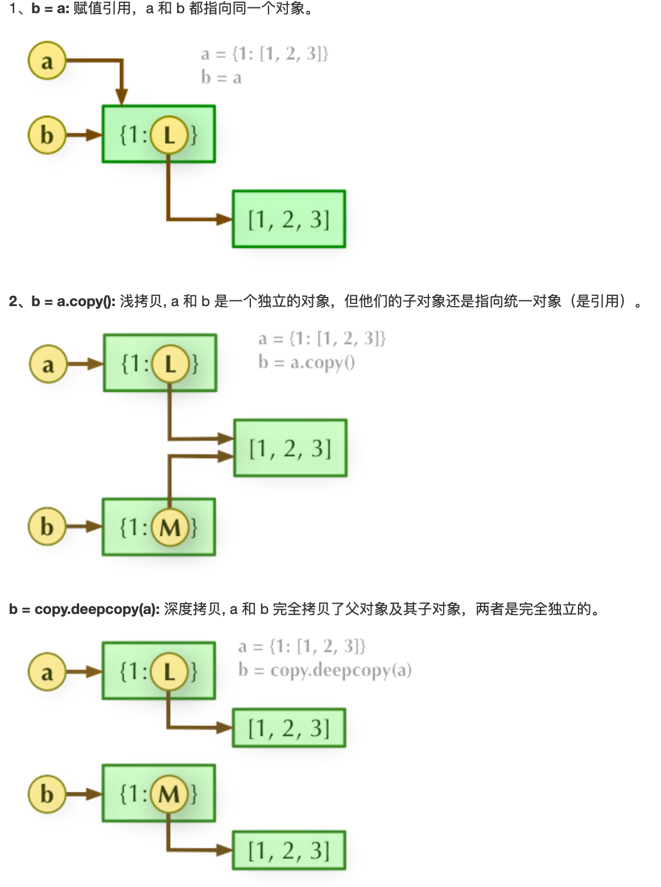

### 可变对象与不可变对象

- Mutable: int, float, string, tuple...

- Immutable: list, dict...

- 不可变对象在赋值后不能改变值。如果改变值，相当于给变量名绑定一个新的内存地址。

- e.g. List和Tuple的区别

  - list可变，tuple不可变。

  - list为homogeneous, tuple为heterogeneous。所以，tuple常常用于储存不同类型的pair。

### 深浅拷贝

- **Assignment** statements in Python do not copy objects, they create bindings between a target and an object. 
- 有时需要拷贝一个可变对象，使得原对象改变值时不影响新对象。此时，需要深拷贝 Deep Copy。
- The difference between shallow and deep copying is only relevant for **compound objects** (objects that contain other objects, like lists or class instances):
  - A *shallow copy* constructs a new compound object and then (to the extent possible) inserts *references* into it to the objects found in the original.
  - A *deep copy* constructs a new compound object and then, recursively, inserts *copies* into it of the objects found in the original.
- 

### 可变参数与关键字参数

- **可变参数**：在参数前加上`*`，即可传入任意数量的参数，函数内部会自动将这些参数打包在**tuple**中。

  - 将list或tuple的所有元素当作可变参数传入，可以写成*func*(*Iterator)的形式。

- **关键字参数**：在参数前加上`**`，即可传入任意数量的参数，函数内部会自动将这些参数打包在**dict**中。

  - 将dict的所有key-value pairs作为关键字参数传入，可以写成*func*(\*dict)的形式。

- **命名关键字参数**：使用`*`分隔符。

  - ```python
    def person(name, age, *, city, job):
        print(name, age, city, job)
    ```

  - `*`后面的皆为关键字参数。这样可以限制关键字参数的名字。

  - 调用时，必须传入参数名。`person('kcirtaP', 21, city='Shenzhen', job='student')`

- **参数组合顺序**：必选参数、默认参数、可变参数、命名关键字参数和关键字参数。

- 习惯写法：`func(*args, **kw)`

### 生成器 Generator

- **yield关键字**，使函数成为generator。生成器在yield处暂停，调用next()从断点继续。作用是将算法储存在函数内，并逐步计算。

- e.g. Fibonacci generator

  - ```python
    def fib(max):
        n, a, b = 0, 0, 1
        while n < max:
            yield b
            a, b = b, a + b
            n = n + 1
        return 'done'
    ```

### map()/reduce()/filter()

- map(*function*, Iterator). Apply the function to every element of the iterator, and return a new iterator.
- reduce(*function*, Iterator). Apply the function to all elements accumulatively. e.g. reduce(*f*, [x1, x2, x3])=*f*(*f*(x1, x2), x3).
- filter(*function*, Iterator). Apply the function to every element of the iterator, if return True, the element is remained. Use list() to get the result.

### 闭包 Closure

- 闭包，就是将**组成函数的语句**和这些语句的**执行环境**打包在一起时，得到的对象

- ```python
  def sum(init):
    
  	def add(num):
  		nonlocal init
  		init += num
  		return init
    
  	return add
  ```

- 在函数内定义另一个函数，并返回这个函数。返回时，函数尚未执行，需要手动执行。

- 在需要改变局部变量时（此例中的*init*），需要在内层函数声明nonlocal，这样编译器会在外层作用域寻找变量名。

- 闭包能保存局部变量和函数的状态。

### 装饰器 Decorator

- 动态增加函数的功能，而不改变函数主体的代码。装饰器本身是一个闭包。

- ```python
  def log(text):
      def decorator(func):
          @functools.wraps(func)
          def wrapper(*args, **kw):
              print('%s %s():' % (text, func.__name__))
              return func(*args, **kw)
          return wrapper
      return decorato
  ```

- 使用3层装饰器，可以实现装饰器传参。

### 模块 Module

- 模块可以组织存放在被称为**包**的目录下。包里必须含有`__init__.py`文件。
- `if __name__=='__main__'`：在运行模块文件时，判断成立；而该模块被其他文件导入时，判断失败。这种写法可以让一个模块通过命令行运行时执行运行测试。
- import搜索顺序：先搜索当前目录（如果未指定路径）或指定包目录，然后在sys.path储存的路径中搜索。
  - sys.path.append('PATH_TO_MODULE')可以临时添加搜索目录。
  - 设置环境变量PYTHONPATH可以长期生效。

### 面对对象编程 Object Oriented Programming 

- **访问限制**：在属性前加上`__`，使其成为private，外部无法访问。

- **特殊变量**：前后双下划线，如`__name__`。

- **多态**：在子类中重写（override）父类中的方法。然后，可以定义函数，其参数为父类类型，在函数体中调用被重写的方法。在传入不同的子类时，会调用相应子类的方法。

  - 优点：符合开闭原则，对扩展开放，对修改封闭。
  - 由于Python是动态语言，传入的不一定非要是对应的子类。只要传入的类有对应方法即可。（鸭子类型 Duck Typing）

- **类属性**：直接在class中定义。类似于static变量，所有实例均可访问此属性。

- **动态绑定**：可以给Python类动态绑定属性与方法。

- ```python
  class Student(object):
      pass
   
  def set_age(self, age):
      self.age = age
  
  # 给一个实例绑定方法
  from types import MethodType
  s.set_age = MethodType(set_age, s)
  s.set_age(25)
  s.age
  
  # 给整个类绑定方法
  Student.set_age = set_age
  ```

  - `__slot__`用于限制能添加的属性，如`__slot__ = ('name', 'age')`。

- **@property**

  - 使用@property来获取实例属性
  - 使用@attr.setter来修改实例属性
  - 优点：可以定义只读属性，还可以对赋值参数进行检查。

- **多重继承**

  - MixIn设计

- **动态创建类**

  - Python支持运行期间动态创建类。

  - 使用type()

  - ```python
    def fn(self, name='world'): # 先定义类方法
        print('Hello, %s.' % name)
    
    Hello = type('Hello', (object,), dict(hello=fn))
    ```

    - 参数分别为：类名、父类tuple、绑定方法。

  - metaclass

### 错误/异常 Error/Exception

- 异常处理：`try... except... finally...`
- 抛出异常：`raise...`
- 捕捉到错误后，如果不知道如何处理，可以用`raise`再次抛出到上层调用者。